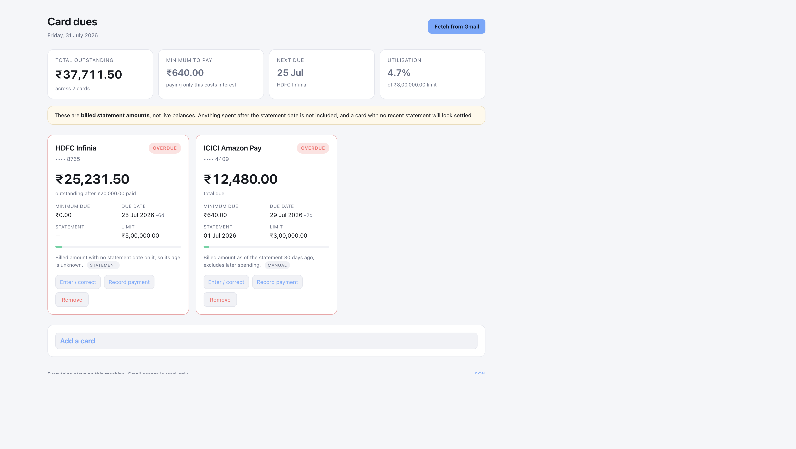

# card-dues

Track what you owe on your Indian credit cards, in one place, on your own machine.

It reads statement emails from Gmail (read-only), unlocks the password-protected
PDFs, extracts the total due, minimum due, payment due date and the individual
transactions per card, and shows them in a local dashboard. A separate Expenses
tab pulls bank / UPI spend-alert emails into a monthly ledger. Anything it cannot
read, you type in yourself. Dates are written and read as **dd/mm/yyyy** throughout.



## What this can and cannot tell you

**It shows your billed statement amount, not a live balance.** Spending after the
statement date is not included. Every figure carries its statement date, its
source and an as-of timestamp, and a card whose statement is older than 40 days
is flagged as stale rather than quietly shown as settled.

There is no way around this for a personal project:

- **Account Aggregator** has a credit-card schema (`totalDueAmount`, `minDueAmount`,
  `creditLimit`, `availableCredit`) but no issuer has activated the credit-card
  FI type, and access requires being a regulated FIU.
- **Bharat Connect (BBPS) bill fetch** does return the billed amount, minimum due
  and due date across most large issuers, but only to a registered BBPS agent
  under a Customer Operating Unit. That means business onboarding through a
  provider such as Setu or Cashfree.
- **Issuer APIs** exist but are per-bank partner integrations.

The data model uses ReBIT's field names so a BBPS or AA source can be added later
as just another `source` alongside `statement` and `manual`.

## Prerequisites

- **Python 3.11+** (see `requires-python` in `pyproject.toml`)
- A Gmail account that receives your card statements (and optionally spend alerts)
- A Google Cloud project with the **Gmail API** enabled and an OAuth client
  (setup below)
- macOS is the primary target for `carddues notify` and the LaunchAgent script;
  the web app and CLI work on any OS that can run Python

Optional: [uv](https://docs.astral.sh/uv/) if you prefer lockfile-based installs
(`uv.lock` is in the repo).

## Setup

Clone the repo, then install dependencies and initialise the local database.

### With pip / venv

```bash
git clone <repo-url> card-dues
cd card-dues
python3 -m venv .venv
.venv/bin/pip install -r requirements.txt
.venv/bin/pip install -e .
.venv/bin/python -m carddues init
```

### With uv

```bash
git clone <repo-url> card-dues
cd card-dues
uv sync
uv run carddues init
```

`init` creates `~/.carddues/` (mode `0700`) with an empty SQLite database and an
attachments directory. After an editable install, the `carddues` command is on
your PATH inside the venv; otherwise use `.venv/bin/python -m carddues …`.

For development / tests, also install:

```bash
.venv/bin/pip install -r requirements-dev.txt
# or: uv sync --extra dev
```

### Connect Gmail

1. In [Google Cloud Console](https://console.cloud.google.com/), create a project
   and enable the **Gmail API**.
2. On the OAuth consent screen, choose **External**, and add your own Gmail
   address under **Test users**. The app stays unverified, which is fine for one
   user. (While the consent screen is in **Testing**, refresh tokens expire about
   every 7 days — see [docs/gmail-oauth.md](docs/gmail-oauth.md).)
3. Create an OAuth client. Either type works:
   - **Desktop app** — nothing else to configure. Google allows the loopback
     redirect this app uses.
   - **Web application** — add this authorised redirect URI:

     ```
     http://127.0.0.1:8765/oauth/callback
     ```

4. Download the JSON and save it as `~/.carddues/credentials.json`
   (or set `CARDDUES_CREDENTIALS` to another path).
5. Start the dashboard and click **Connect Gmail**. Google's consent screen opens,
   and the redirect back finishes the connection — no terminal step.

```bash
.venv/bin/python -m carddues serve
# open http://127.0.0.1:8765
```

If you serve on a different port, the dashboard prints the exact redirect URI to
register. A desktop client can also be authorised from the terminal with
`.venv/bin/python -m carddues auth`.

The scope requested is `gmail.readonly`, so this can list and download mail but
never send, modify or delete it. The token is stored at `~/.carddues/token.json`
with owner-only permissions. **Disconnect Gmail** on the dashboard forgets that
token; to revoke the grant itself, remove the app from your
[Google account permissions](https://myaccount.google.com/permissions).

Token expiry and moving the consent screen to Production are covered in
[docs/gmail-oauth.md](docs/gmail-oauth.md). Restarting a stuck dashboard is covered
in [RESTART.md](RESTART.md).

## Configuration

| Variable / path | Purpose |
|-----------------|--------|
| `CARDDUES_HOME` | Data directory (default `~/.carddues`) |
| `CARDDUES_CREDENTIALS` | Path to Google OAuth client JSON (default `$CARDDUES_HOME/credentials.json`) |
| `$CARDDUES_HOME/carddues.db` | SQLite database (cards, statements, transactions, expenses, categories) |
| `$CARDDUES_HOME/credentials.json` | OAuth client downloaded from Google Cloud |
| `$CARDDUES_HOME/token.json` | Access + refresh tokens after Connect Gmail |
| `$CARDDUES_HOME/attachments/` | Downloaded statement PDFs (usually deleted after parse) |
| `$CARDDUES_HOME/session_secret` | Flask session key (auto-created, mode `0600`) |

Nothing is sent anywhere except Google's OAuth and Gmail APIs for mail you already
own. This project never asks for net banking credentials and does no screen scraping.

Tunables in code (not env vars): statement lookback defaults to **1 month** on
the dashboard (overridable; CLI still defaults to **400 days** via `--days`);
expense-alert lookback defaults to **7 days** (overridable on Fetch); a statement older than **40 days**
is treated as stale.

## Dashboard

```bash
carddues serve                  # http://127.0.0.1:8765
carddues serve --port 8766      # different port → update OAuth redirect URI
carddues serve --debug          # auto-reload while developing (local only)
```

Three tabs:

### Credit cards

- Portfolio summary: total outstanding, minimum to pay, next due, utilisation
- **Billed in Month** — sum of each statement's `total_due` whose
  **`statement_date`** falls in the **10th–9th window** for that month label
  (e.g. July includes statements generated 10 Jul through 9 Aug inclusive; not
  calendar-day purchase debits). Purchases on a July bill can have June
  `txn_date`s; those still belong to the July billed total. Month navigation is
  Prev / Next.
- Per-card breakdown of that month's billed totals, plus category totals from
  the line items on those statements
- Per card: latest statement (or an older cycle from **Statements**), payments,
  manual override, unlock for locked PDFs, show transactions. Each card shows
  **Statement total** (`total_due` for the cycle being viewed — latest by
  default), not credit limit; credit limit remains editable in the set form and
  still feeds the portfolio utilisation tile when known
- **Fetch from Gmail** (default lookback **1 month**, editable on the Cards
  tab) / **Re-parse statements** when connected

### Expenses

Separate from statement PDFs so dues Fetch never double-counts alert mail.

- Monthly ledger of amounts from bank / UPI **transaction alert** emails.
  Discovery uses **subject hints** (UPI apps, common alert titles) **or** mail
  from known **issuer domains** that mention spend cues (`Rs.`, `debited`,
  `spent`, `UPI`, …). Statement and loan-offer subjects are skipped; parsing
  reads amount, date, and merchant from the body with bank-agnostic patterns
  rather than per-bank subject rules alone
- **Fetch expense alerts** (default lookback **7 days**, editable on the button
  row) and **Refresh descriptions from Gmail**
- Add / edit / delete expenses by hand; **Show email** for Gmail-sourced rows
- Totals and category breakdown for the selected calendar month (`spent_on`)

### Categories

Shared rules for statement line items and the expenses ledger.

- Resolution order: issuer-printed category → learned merchant → phrase /
  keyword rules
- Edit phrase rules and merchant memory; **Re-apply category rules** updates
  blank and auto-categorised rows (manual edits stay put; issuer labels only
  change when a learned merchant matches)

## CLI workflows

After `pip install -e .` (or `uv sync`), use `carddues`. Otherwise prefix with
`.venv/bin/python -m carddues`.

```bash
# Register a card. Name and date of birth are used to derive PDF passwords.
# Adding a card also retries the statements still waiting to be opened.
carddues cards add --issuer hdfc --last4 8765 --label "HDFC Infinia" \
                   --limit 500000 --name "Naveen Kumar" --dob 01/07/1990
carddues cards list
carddues cards remove 8765

# Fetch and parse statements from Gmail
carddues ingest --show
carddues ingest --days 120 --limit 50 --keep-files

# Or parse a PDF you already have
carddues import ~/Downloads/statement.pdf --password mypassword

# Type in anything the parser could not read; manual entries always win
carddues set 8765 --total 45231.50 --min 2270 --due 03/08/2026

# Record a payment (defaults to the full outstanding amount)
carddues paid 8765 --amount 20000

# Open a statement that stayed locked; the password is kept for next month
carddues unlock 'NAVE1504' --file statement.pdf

# Work through the backlog of waiting attachments, a batch at a time (40 default)
carddues reprocess --issuer hdfc

# Re-read already-parsed PDFs after a parser fix (Fetch skips those)
carddues reparse --issuer icici

carddues show          # table in the terminal
carddues show --json   # machine readable
carddues log           # what the last ingest did with each attachment
carddues audit         # weak / incomplete parses across cards

carddues serve         # dashboard on http://127.0.0.1:8765
```

Supported `--issuer` keys include: `hdfc`, `icici`, `sbicard`, `axis`, `kotak`,
`idfcfirst`, `amex`, `hsbc`, `indusind`, `rbl`, `yesbank`, `au`, `federal`,
`onecard`, and `other`. Unknown mail still falls through to a generic parser.

### Daily refresh and notifications

`carddues notify` sends a **macOS** notification when a card is overdue or due
within three days. To run ingest + notify every morning, edit the path in
`scripts/com.carddues.refresh.plist` (replace `REPLACE_WITH_PROJECT_PATH`) and
load it:

```bash
cp scripts/com.carddues.refresh.plist ~/Library/LaunchAgents/
# edit REPLACE_WITH_PROJECT_PATH in the copied file
launchctl load ~/Library/LaunchAgents/com.carddues.refresh.plist
```

## How parsing works

`carddues/parsers/base.py` handles the two layouts statements actually use:

- **Inline** — `Total Amount Due : Rs. 1,12,480.35`
- **Table** — a row of labels with the values in the row beneath, aligned by
  column position so an extra unlabelled column does not shift everything

Issuer parsers in `carddues/parsers/banks.py` only declare which wording that
issuer prefers; the shared extractor does the rest. Amounts understand Indian
digit grouping and a trailing `Cr` (a credit balance, stored as negative).

`carddues/parsers/transactions.py` reads the line items. A statement that rules
its transactions into a grid names its columns, so those are read first, category
column included. The rest print one transaction per line, opening with a date and
closing with an amount, which is what separates a transaction from the summary
rows above it — a trailing reward-points column or a second posting date does not
confuse it. Most Indian statements print no category at all, so the merchant name
is matched against phrase / keyword rules and the result is marked **guess** in
the table to keep it apart from a category the issuer itself printed.

To add an issuer, add an entry to `carddues/issuers.py` with its sending domains
and a text marker, then a small class in `banks.py` if its wording is unusual.
Unknown issuers fall through to the generic parser, which handles most formats.

## How locked statements are opened

Issuers state the password rule in the covering mail, so `carddues/passwords.py`
reads it rather than guessing. It looks only at the sentences mentioning the
password, breaks the rule into components — "first 4 letters of your name in
capitals", "date of birth in DDMM", "last 4 digits of your card" — and fills them
from the card you registered. "NAVE1504" comes out of one attempt instead of
roughly 190.

Three things happen when that isn't enough. A rule needing details you never
supplied (five card digits, when only the last four are on file) is refused
rather than half-guessed. Anything unrecognised falls back to the permutations of
name, date of birth, PAN and card digits that the module generated before. And if
none of those open the file, the PDF is kept on disk and listed on the dashboard
with a password box; whatever you type there is remembered on the card, so the
next month's statement opens unattended.

A statement from a card you never registered is the hardest case, because there
are no details to build a password from at all. For those, the dashboard shows
who sent the mail, its subject and date, and quotes the password rule it stated,
so you can work the password out yourself and type it once. Unlocking registers
the card automatically from the statement, so it only happens the first time.
Those details are captured during the fetch, so attachments logged by an earlier
version show none until they are tried again — and they are, since every card you
add sets the waiting attachments going through the same route, re-downloading each
one from its mail when it is no longer on disk. A pass takes 40 attachments and
says how many are left, so **Try these again** on the dashboard (or
`carddues reprocess`) works through a long backlog without a request that never
ends. The pass covers that issuer's attachments plus any whose issuer was never
recorded, which is what older log rows look like.

## Troubleshooting

| Symptom | What to try |
|---------|-------------|
| Dashboard shows **Fetch from Gmail** but Connect never worked / old UI | Another process still owns port 8765 — see [RESTART.md](RESTART.md) |
| Gmail fetch fails after ~7 days | OAuth consent still in **Testing** — reconnect, or publish to Production ([docs/gmail-oauth.md](docs/gmail-oauth.md)) |
| Statements stay **locked** | Add `--name` / `--dob` (and last4) on the card, or unlock once on the dashboard / `carddues unlock` |
| Wrong billed month total | Cards tab uses **`total_due`** for statements in the **10th–9th** window (e.g. July = 10 Jul–9 Aug), not txn calendar days |
| Expenses empty after Fetch | Alerts need matching subjects and no PDF attachment; statements are excluded on purpose |
| Parser missed dues / dates | `carddues set` for a manual override; `carddues audit` / `carddues reparse` after a parser fix |
| Move all data | Set `CARDDUES_HOME` before any command; copy the old directory if migrating |

## Tests

```bash
.venv/bin/pip install -r requirements-dev.txt
.venv/bin/python -m pytest
# or: uv run pytest
```

The suite covers the parsers against realistic statement layouts, real encrypted
PDF unlocking, password rules read from real issuer wordings, transaction and
category extraction, expenses ingest, the Cards-tab billed month totals
(`total_due` for the 10th–9th statement-date window), the statement history picker, retrying a
backlog against a stubbed Gmail, the due-resolution rules, and the dashboard
routes.

Developer helper (writes golden fixtures from your own kept PDFs):

```bash
carddues dump-golden --out tests/golden
```
